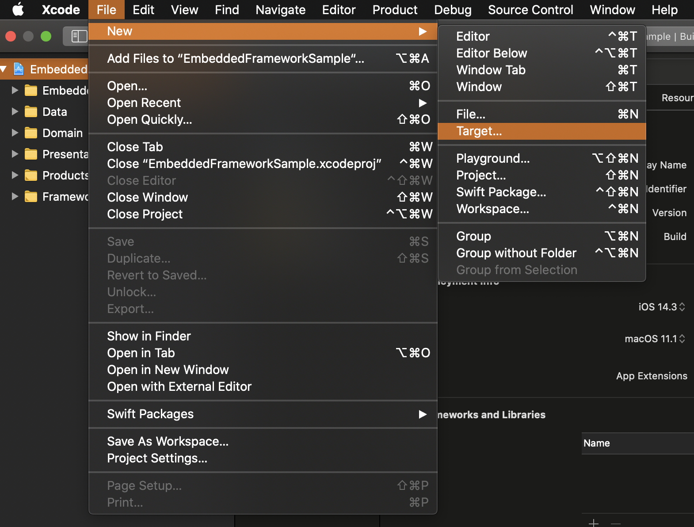
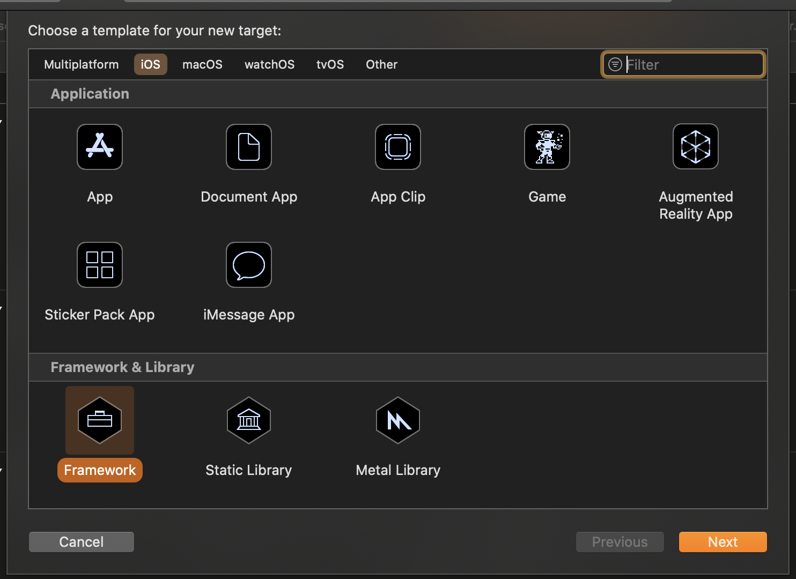
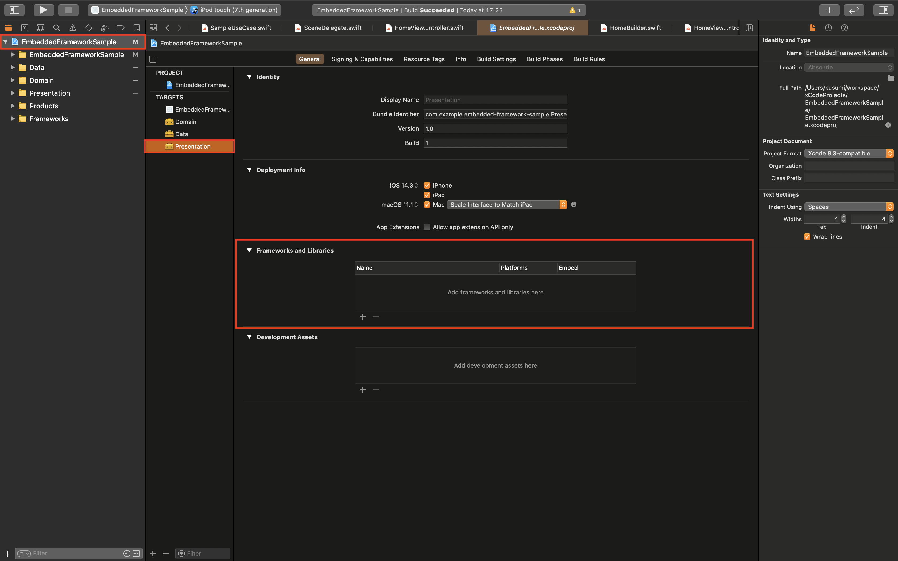

# EmbeddedFrameworkSample

## EmbeddedFrameworkとは

- アプリのコードを分割してFrameworkとして扱うことができる。
- 外部Frameworkに対してEmbedded(組み込みの)Framework
- 差分コンパイルによるビルド高速化が期待できる。
- 依存関係がシンプルになる。
- Frameworkごとにテストを書くことができる。

## 導入手順

1. File → New → Targeを選択

2. Framework & Library → Frameworkを選択

3. プロジェクト設定 → General → TARGETを選択 →　Frameworks and Libraries → 依存するFrameworkを選択

## 備考

- XcodeGenを使う場合は、ymlからFramework生成の設定をしないといけない。